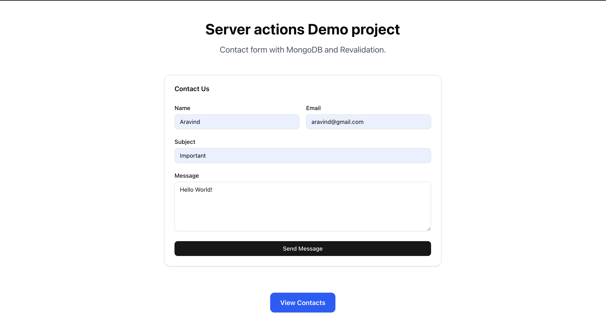
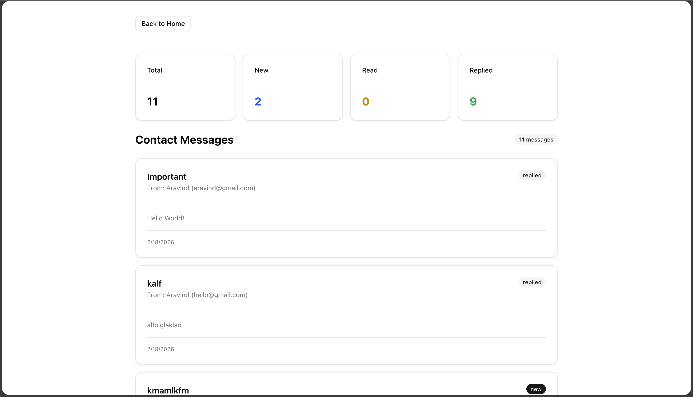
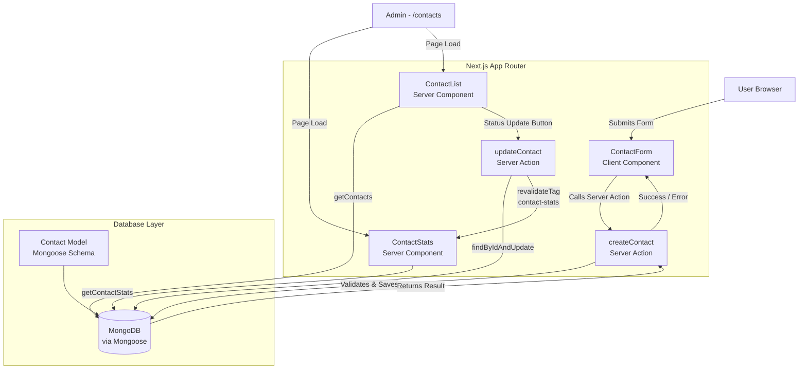

<h1 align="center">📬 Contact Form — Server Actions Demo</h1>

A full-stack contact management application built with **Next.js 16** and **MongoDB**. Submit, track, and manage contact messages with a beautiful admin dashboard — all powered by **React Server Actions** with zero API routes.

### Visit [Contact Form App on Vercel](https://contact-form-gmarav05.vercel.app/)

---


## 📋 Overview

Contact Form is a production-ready demo showcasing the full power of **Next.js Server Actions**. Users can submit contact messages through a polished form, while admins can view, track, and update message statuses through a real-time dashboard — all without writing a single API route.

---

## Live Demo


https://github.com/user-attachments/assets/e1d10535-f215-4ca7-93fa-bc8547b2c85b


## 🖼️ Screenshots

```
 </br>
 </br>
```

---

## 🌟 Features

### Core Functionality

- **Contact Form** — Submit messages with name, email, subject, and message fields with instant feedback.

- **Admin Dashboard** — View all submitted messages at a glance in a clean card-based layout.
- **Status Management** — Progressively update messages through `new → read → replied` states.
- **Stats Overview** — Live stat cards showing Total, New, Read, and Replied message counts.
- **Form Auto-Reset** — Form clears automatically on successful submission.
- **Error Handling** — Graceful error messages returned from server to client.

### Technical Features
- **Zero API Routes** — All data mutations and reads handled entirely via Server Actions.

- **Server Components** — `ContactStats` and `ContactList` fetch data at render time — no `useEffect` needed.
- **Tag-Based Revalidation** — Surgical cache invalidation using `revalidateTag` keeps stats fresh after updates.
- **Mongoose Singleton** — Connection caching prevents pool exhaustion across hot-reloads in development.
- **shadcn/ui** — Accessible, composable component system built on Radix UI primitives.
- **Tailwind CSS v4** — Latest utility-first styling with CSS variable theming.

### UX Features
- **Responsive Design** — Mobile-first layout that works across all screen sizes.

- **Loading States** — Button and input disabled states during form submission.
- **Visual Feedback** — Green/red banners for success and error states.
- **Status Badges** — Color-coded badges for each message status.
- **Empty State** — Friendly empty state when no messages exist yet.

---

## 📚 Learnings

- Learned how **React Server Actions** replace traditional API routes for form handling and data mutations.

- Understood the difference between **Server Components** (data fetching at render) and **Client Components** (interactivity and state).
- Practiced **tag-based cache revalidation** with `revalidateTag` for fine-grained data freshness control.
- Learned the **Mongoose singleton connection pattern** to safely reuse database connections in Next.js.
- Understood how to define **inline Server Actions** inside JSX for co-located mutation logic.
- Practiced building with **shadcn/ui** and integrating Radix UI primitives with Tailwind CSS.
- Learned how **Next.js App Router** handles nested layouts, server-side data fetching, and page organization.

---

## 🏗️ Application Architecture



---

## 💻 Technology Stack

| Category | Technologies |
|----------|-------------|
| **Frontend Framework** | Next.js 16.1.6, React 19.2.3 |
| **Language** | JavaScript (JSX) |
| **Database** | MongoDB, Mongoose 9.2.1 |
| **UI Components** | shadcn/ui, Radix UI |
| **Styling** | Tailwind CSS v4, tw-animate-css |
| **Icons** | Lucide React 0.572.0 |
| **Form Handling** | React Server Actions |
| **Caching** | Next.js `revalidateTag` |
| **Build Optimization** | React Compiler (babel-plugin-react-compiler) |
| **Fonts** | Geist, Geist Mono via next/font |

---

## 📁 Project Structure

```
contact-form-next.js/
├── actions/
│   └── index.js               # All Server Actions (CRUD + stats)
├── app/
│   ├── layout.js              # Root layout with Geist fonts
│   ├── page.js                # Home page with contact form
│   ├── globals.css            # Global styles + Tailwind + CSS variables
│   └── contacts/
│       └── page.js            # Admin dashboard page
├── components/
│   ├── contact-form.jsx       # Client component — form with state
│   ├── contact-list.jsx       # Server component — all messages
│   ├── contact-stats.jsx      # Server component — stat cards
│   └── ui/                    # shadcn/ui component library
│       ├── button.jsx
│       ├── card.jsx
│       ├── input.jsx
│       ├── textarea.jsx
│       ├── label.jsx
│       ├── badge.jsx
│       └── ...                # 40+ additional components
├── lib/
│   ├── db.js                  # MongoDB singleton connection
│   └── utils.js               # cn() Tailwind merge utility
├── models/
│   └── Contact.js             # Mongoose schema & model
├── components.json            # shadcn/ui configuration
├── next.config.mjs            # Next.js configuration
├── postcss.config.mjs         # PostCSS + Tailwind setup
└── package.json               # Dependencies
```

---

## 🚀 Getting Started

### Prerequisites
- Node.js 18+
- A MongoDB connection string (MongoDB Atlas or local instance)

### Installation

```bash
# Clone the repository
git clone https://github.com/yourusername/contact-form-next.js.git
cd contact-form-next.js

# Install dependencies
npm install

# Set up environment variables
touch .env.local
```

### Environment Variables

Add the following to your `.env.local` file:

```env
MONGODB_URI=mongodb+srv://<user>:<password>@cluster.mongodb.net/contactform
```

### Run the Development Server

```bash
npm run dev
```

- **Contact Form** → [http://localhost:3000](http://localhost:3000)
- **Admin Dashboard** → [http://localhost:3000/contacts](http://localhost:3000/contacts)

---

## Contact Model Schema

```js
{
  name:      String   // Required, max 100 characters
  email:     String   // Required, validated format, lowercased
  subject:   String   // Required, max 200 characters
  message:   String   // Required, max 1000 characters
  status:    Enum     // "new" | "read" | "replied" (default: "new")
  createdAt: Date     // Auto-generated timestamp
  updatedAt: Date     // Auto-updated timestamp
}
```

---

## 🔧 Available Scripts

| Command | Description |
|---------|-------------|
| `npm run dev` | Start development server with hot reload |
| `npm run build` | Build optimized production bundle |
| `npm start` | Start production server |
| `npm run lint` | Run ESLint for code quality |

---

## Acknowledgments

- [shadcn/ui](https://ui.shadcn.com/) for the beautiful, accessible component system
- [Next.js](https://nextjs.org/) for the App Router and Server Actions
- [MongoDB Atlas](https://www.mongodb.com/atlas) for the managed database
- [Radix UI](https://www.radix-ui.com/) for the accessible primitive components
- [Lucide](https://lucide.dev/) for the clean icon set


##

<div align="center">

### 🛠️ Built With

**Next.js** • **React** • **MongoDB** • **Tailwind CSS** • **shadcn/ui**

Submit, Track & Manage — effortlessly.

</div>
